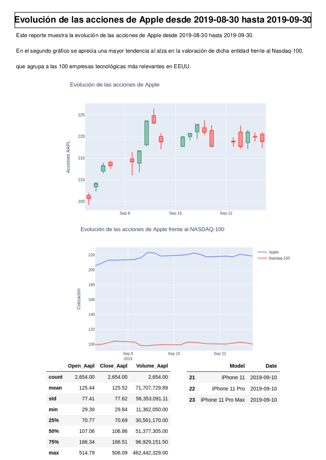

# APIS-PROJECT 
## Apple shares value related to iPhone models introduction
Analysis program of the evolution of Apple's shares between 2010 and 2020 in relation to the launch of new iPhone models.
### 
## Using the program and available commands

Run some of these commands in Terminal as follows. Two types of report are available:
##### - Report by user-defined period of time: Run commands ```-t``` and ```-f```
##### - Report by user-defined model: Run command ```-l```


- ``python3 main.py -h``, ``--help``  show this help message and exit

- ``python3 main.py -m MAIL``,``--mail MAIL``=>  Introduce your mail

- ``python3 main.py  -f DATEFROM``, ``--dateFrom`` DATEFROM => Introduce the starting date for the analysis in format YYYY-MM-DD. Please, note that data is only available from 2010 so the input date must be equal or later

- ``python3 main.py  -t DATETO``, `--dateTo DATETO` => Introduce the ending date for the analysis in format YYYY-MM-DD. Please, note that data is only available until september 2020 so the input date must be equal
  or later
  
- `python3 main.py  -l MODEL`, ``--model MODEL`` => Introduce Iphone model. Available from iPhone 4 (2010) to iPhone SE (2020). Input must be equal to: iphone 4 iPhone 4s iPhone 5 iPhone 5s iPhone 5c iPhone 6 iPhone 6 Plus iPhone 6s iPhone 6s Plus iPhone SE (1ª generación) iPhone 7 iPhone 7 Plus iPhone 8 iPhone 8 Plus iPhone X iPhone XS iPhone XS Max iPhone XR iPhone11 iPhone 11 Pro iPhone 11 Pro Max iPhone SE (2ª generación)


## Path

	- Working_file.ipynb: Jupyter notebook to clean the dataset (internal use)
	- ic data from the dataset
	- 
	- 
	- input folder:
		 + 
		 + 
	- output folder:
		 +
		 + 
	- src: 
		 +
	 

## Source and libraries used
Dataset extracted from Kaggle: [Kaggle link to repo](https://www.google.com)https://www.kaggle.com/tarunpaparaju/apple-aapl-historical-stock-data/notebooks
ETC
ETC
ETC

## Example result



